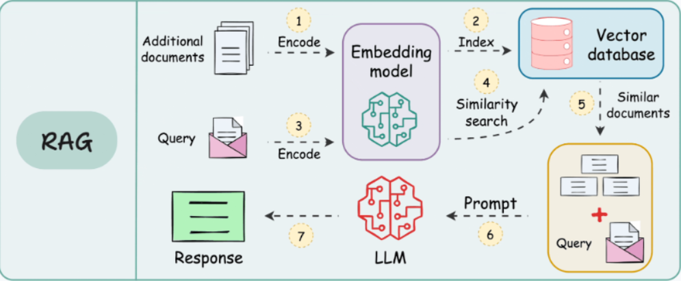

# 🛡️ RAG ISO Compliance Auditor


> **Enterprise-grade AI Assistant for Regulatory Compliance & Internal Auditing.**

## 📋 Descripción del Proyecto

**RAG ISO Compliance Auditor** es una solución de Inteligencia Artificial diseñada para asistir a organizaciones en el proceso de preparación y auditoría interna para certificaciones ISO (enfocada en **ISO 27001** e **ISO 9001**).

Utilizando una arquitectura **RAG (Retrieval-Augmented Generation)**, el sistema ingesta documentación normativa oficial, la procesa vectorialmente y permite a los auditores realizar consultas en lenguaje natural. A diferencia de un chat genérico, esta solución garantiza respuestas **deterministas, fundamentadas en la norma y libres de alucinaciones**, actuando como un "Auditor Senior" virtual.

### 🚀 Valor de Negocio
* **Reducción de Costos:** Disminuye drásticamente las horas-hombre dedicadas a la búsqueda manual en manuales extensos.
* **Precisión:** Mitiga el error humano al citar la cláusula exacta de la norma para cada respuesta.
* **Disponibilidad 24/7:** Asistencia inmediata para equipos de Compliance y QA.

---

## 🏗️ Arquitectura Técnica

El sistema implementa un pipeline de RAG moderno que asegura que el modelo de lenguaje (LLM) solo responda basándose en la información recuperada de la base de conocimiento vectorial.



### Flujo de Datos
1.  **Ingesta (Data Ingestion):** Los documentos PDF de la norma son procesados y divididos en fragmentos lógicos (*chunking*).
2.  **Embedding:** Se utilizan modelos de **Cohere** para transformar el texto en vectores semánticos de alta dimensionalidad.
3.  **Indexación:** Los vectores se almacenan en **ChromaDB**, una base de datos vectorial persistente.
4.  **Recuperación (Retrieval):** Ante una pregunta del usuario, el sistema busca los fragmentos más relevantes por similitud de coseno.
5.  **Generación:** Se construye un *prompt* enriquecido con el contexto recuperado y se envía al LLM (Cohere Command R+) para generar la respuesta final.

---

## 🛠️ Tecnologías y Herramientas

* **Lenguaje:** [Python](https://www.python.org/) (Enfoque en Clean Code y Tipado estático).
* **API Framework:** [FastAPI](https://fastapi.tiangolo.com/) para la creación de endpoints RESTful de alto rendimiento.
* **LLM & Embeddings:** [Cohere API](https://cohere.com/) (Modelos `embed-multilingual` y `command-r`).
* **Vector Store:** [ChromaDB](https://www.trychroma.com/) para almacenamiento y búsqueda semántica eficiente.
* **Procesamiento de Datos:** `PyPDF2` / `LangChain` para manipulación de textos.
* **Contenerización:** [Docker](https://www.docker.com/) para despliegue reproducible.

---

## ✨ Funcionalidades Clave

* ✅ **Respuestas Deterministas:** Configuración de `temperature=0` para asegurar consistencia en auditorías.
* ✅ **Citas de Fuentes:** Cada respuesta indica explícitamente qué sección de la norma se utilizó (Groundedness).
* ✅ **Filtrado por Metadatos:** Capacidad de distinguir entre versiones de normas (ej. 2013 vs 2022) si la metadata está disponible.
* ✅ **API RESTful:** Lista para integración con frontends o sistemas ERP corporativos.
* ✅ **Historial de Conversación:** (Opcional) Persistencia de chats para seguimiento de auditoría.

---

## 📂 Estructura del Proyecto

El proyecto sigue una arquitectura modular basada en capas para facilitar la escalabilidad y el mantenimiento.

```text
RAG-ISO-COMPLIANCE-AUDITOR/
│
├── app/
│   ├── api/             # Routers y Endpoints (Capa de Presentación)
│   ├── business/        # Lógica de Negocio (Coordinación RAG)
│   ├── core/            # Configuraciones y Prompts del Sistema
│   ├── db/              # Capa de Datos (Repositorios Vectoriales y SQL)
│   ├── schemas/         # Modelos Pydantic (Validación de Datos)
│   └── services/        # Integraciones Externas (Cohere, PDF Parsing)
│
├── docker/              # Dockerfiles para despliegue
├── logs/                # Logging de las actividades del sistema
├── tests/               # Tests unitarios y de integración
├── .env                 # Variables de entorno (No incluido en repo)
├── main.py              # Punto de entrada de la aplicación
└── requirements.txt     # Dependencias del proyecto